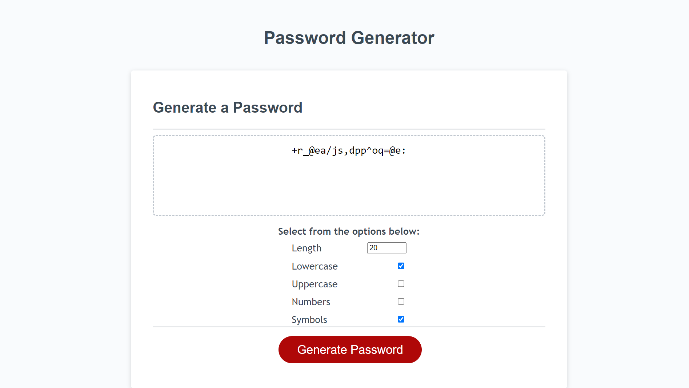

# Password Generator

## Description

This project was created to showcase knowledge of JavaScript by creating a password generator that generates a random password based on user-chosen parameters including: lengths from 8 - 128, uppercase letters, lowercase letters, numbers, and special characters.

## Usage

The initial generate function drops the options menu which allows the user to select their desired parameters for their generated password. Clicking generate after this intial step will generate a password. Clicking generate again will generate a new one.

Note: At least one option must be selected for generation to occur.

Note 2: Due to the nature of the password generation (generating larger than desired size, shuffling it, then slicing it), there is a rare chance that one of the desired parameters will not appear in a password. This can be remidied by modifying the password manually, generating a new one, or increasing the desired length. Again, this is fairly rare.

Link to the password generator itself:

https://kevrev.github.io/password-generator/

One can also view the index.html, script.js, and style.css files independently in the GitHub repository:

https://github.com/Kevrev/password-generator

## Credits

FlorinPop17 for their password generator [walkthrough](https://codepen.io/FlorinPop17/pen/BaBePej). It provided a good reference point for how exactly a password generator could work and was something to glance back at when stuck. My random generation function for grabbing characters from a string (used for the numbers and symbols parameters) ultimately ended up being the same as this one.

Tutorials Point for their [Fisher-Yates shuffle tutorial](https://www.tutorialspoint.com/what-is-fisher-yates-shuffle-in-javascript). Their explanation of the concept and tutorial were instrumental for implementing the password scramble into the password generator.
